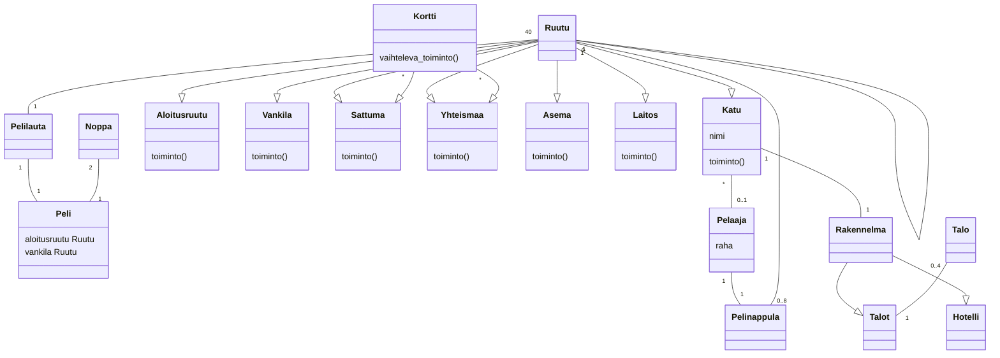

```mermaid
classDiagram
    Pelilauta "1" -- "1" Peli
    Ruutu "40" -- "1" Pelilauta
    Pelinappula "0..8" -- "1" Ruutu
    Pelaaja "1" -- "1" Pelinappula
    Noppa "2" -- "1" Peli
    Ruutu "1" -- "0" Ruutu
    %%Pelaaja "2..8" -- "1" Peli

    Ruutu --|> Aloitusruutu
    Ruutu --|> Vankila
    Ruutu --|> Sattuma
    Ruutu --|> Yhteismaa
    Ruutu --|> Asema
    Ruutu --|> Laitos
    Ruutu --|> Katu

    Kortti "*" --|> Sattuma
    Kortti "*" --|> Yhteismaa

    Katu "*" -- "0..1" Pelaaja

    Rakennelma --|> Talot
    Rakennelma --|> Hotelli
    Katu "1" -- "1" Rakennelma

    Talo "0..4" -- "1" Talot
    
    class Peli {
        aloitusruutu Ruutu
        vankila Ruutu
    }
    class Aloitusruutu {
        toiminto()
    }
    class Vankila {
        toiminto()
    }
    class Sattuma {
        toiminto()
    }
    class Yhteismaa {
        toiminto()
    }
    class Asema {
        toiminto()
    }
    class Laitos {
        toiminto()
    }
    class Katu {
        nimi
        toiminto()
    }
    class Kortti {
        vaihteleva_toiminto()
    }
    class Pelaaja {
        raha
    }
```
