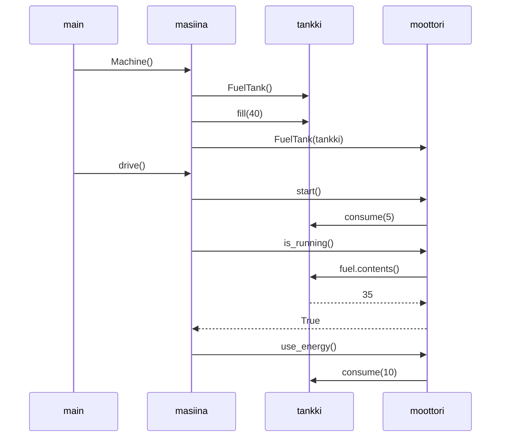

```mermaid
sequenceDiagram
    main ->> masiina: Machine()
    masiina ->> tankki: FuelTank()
    masiina ->> tankki: fill(40)
    masiina ->> moottori: FuelTank(tankki)
   
    main ->> masiina: drive()
    masiina ->> moottori: start()
    moottori ->> tankki: consume(5)
    masiina ->> moottori: is_running()
    moottori ->> tankki: fuel.contents()
    tankki -->> moottori: 35
    moottori -->> masiina: True
    masiina ->> moottori: use_energy()
    moottori ->> tankki: consume(10)
```
